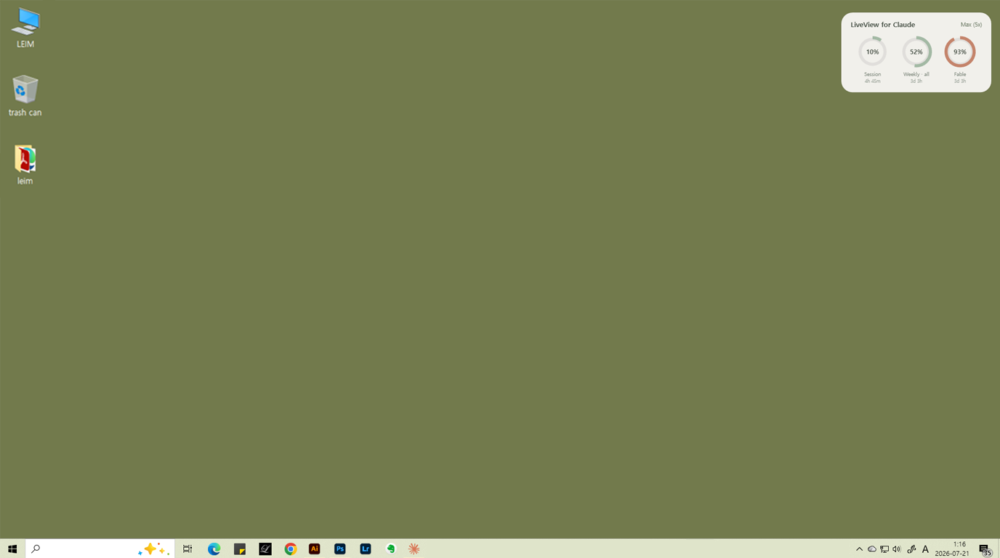
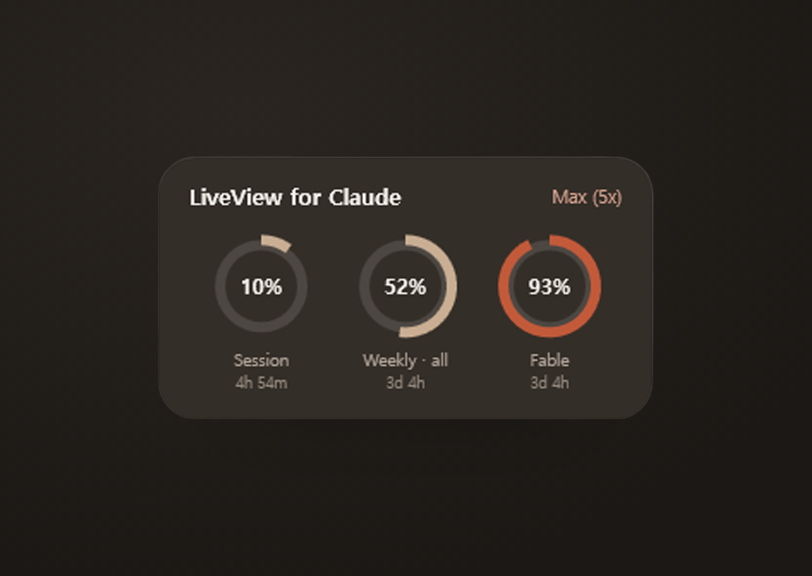
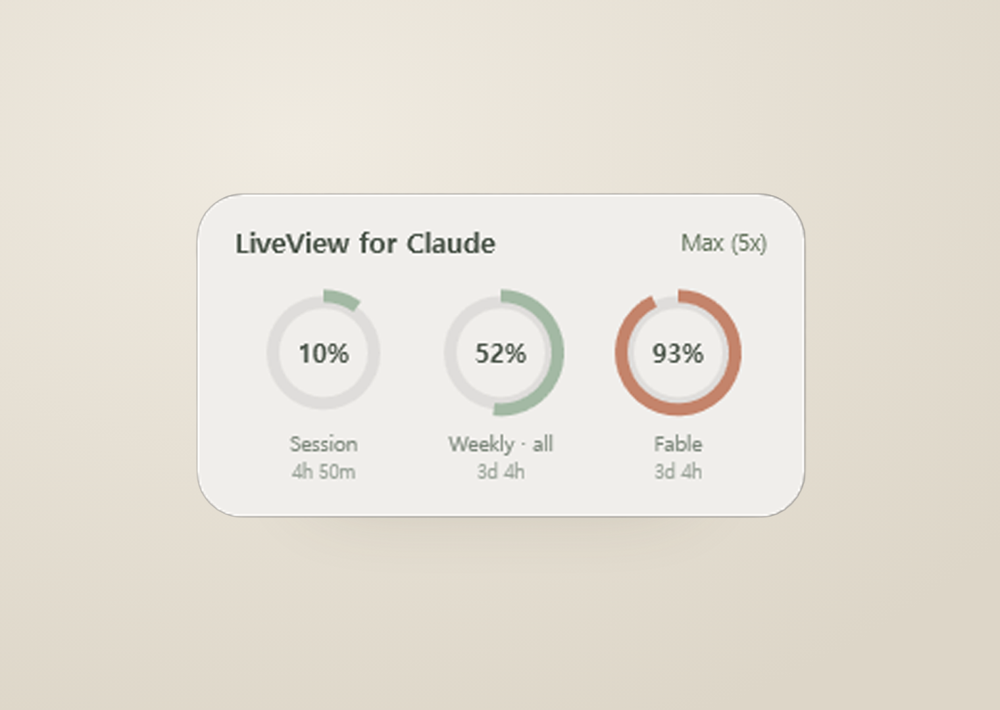

# LiveView for Claude

**A tiny always-on-top widget for Windows that shows your Claude usage in real time.**

Stop opening claude.ai settings ten times a day. LiveView sits quietly on your screen and shows your 5-hour session, weekly, and per-model (Opus, Fable, …) usage as minimal ring gauges — refreshed every minute, with reset countdowns.

> 🎨 **Made by an artist, not a developer.** This app was designed and built by [Loren Kim](https://www.instagram.com/artist_lorenkim) — a visual artist and founder of the Korea-based design studio [LEIM](https://www.leim.kr) — entirely by conversing with Claude. Every line of code, from the OAuth flow to the WPF ring gauges, was written through Claude (Cowork). The design system is hers.

| Night (warm brown) | Day (sage green) |
|---|---|
|  |  |

## Features

- **Always-on-top mini window** — drag it anywhere; it remembers its position
- **Ring gauges** for your 5-hour session, weekly all-models, and per-model weekly limits (Fable, Opus, … shown automatically as Anthropic adds them)
- **Reset countdowns** — see exactly when each limit resets, at a glance
- **Day & night themes** — sage-green light mode, warm-brown dark mode (◐ to toggle)
- **Official OAuth sign-in** — the same authorization flow Claude Code uses; no cookies, no password, tokens auto-refresh
- **Auto-language** — Korean or English, following your Windows language
- **Zero install** — two small script files; no admin rights, nothing bundled
- **Fully auditable** — it's a plain PowerShell script; open it and read every line

## Install (2 minutes)

1. Download the latest release and unzip it anywhere (e.g. `Documents\LiveView`).
2. Double-click **`ClaudeUsageWidget.bat`**.
3. Click **[1. Open sign-in in browser]**, sign in to Claude, click **Authorize**, copy the code, paste it into the widget, click **[2. Connect]**. Done.

Optional: run **`autostart-on.bat`** once to launch LiveView automatically at login (`autostart-off.bat` to undo).

## Privacy & security

- Your OAuth token is stored **only on your PC** (`%APPDATA%\ClaudeUsageWidget\config.json`).
- The widget talks **only to Anthropic servers** (`api.anthropic.com`, `claude.ai`). Nothing else, ever.
- No telemetry, no analytics, no third-party services. It's a readable script — verify it yourself.

## Requirements

- Windows 10 or 11 (PowerShell 5.1, preinstalled)
- A Claude account (Pro / Max — any plan with usage limits)

> 🍎 A **macOS version** (menu bar) is planned — star the repo to hear when it lands.

## Troubleshooting

- **"Session expired"** → open ⚙ and reconnect.
- **"Rate limited"** → the widget waits and retries automatically; just leave it.
- Anything else → check `debug_log.txt` next to the script, and open an issue with its contents.

## Disclaimer

This is an **unofficial** community tool and is not affiliated with or endorsed by Anthropic. It reads usage data through Anthropic's OAuth endpoints, which may change at any time.

## Credits

**[LEIM](https://www.leim.kr)** is a design studio specializing in design, branding, and letterpress printing, run by artist **Loren Kim** ([@artist_lorenkim](https://www.instagram.com/artist_lorenkim)).
This app was built with **Claude** by Anthropic.

License: [MIT](LICENSE) · 한국어 안내는 [README.ko.md](README.ko.md)
